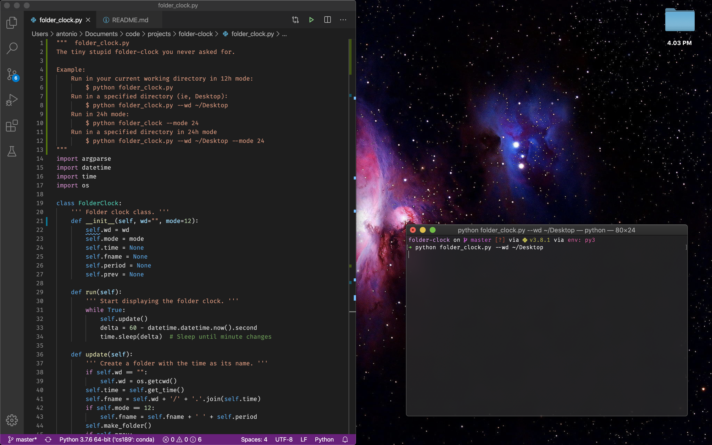

# folder-clock

The tiny stupid folder-clock you never asked for.

## Usage
Run in your current working directory in 12h mode (default):
```console
$ python folder_clock.py
```

Run in a specified directory (ie, Desktop) in 12h mode:
```console
$ python folder_clock.py --wd ~/Desktop
```

Run in 24h mode:
```console
$ python folder_clock --mode 24
```

Run in a specified directory in 24h mode
```console
$ python folder_clock.py --wd ~/Desktop --mode 24
```

## Example

As someone with an aversion to status bars and docks, I needed a way to see the time without hovering over the edge of the screen to pull up the clock. So, folder-clock it is.


